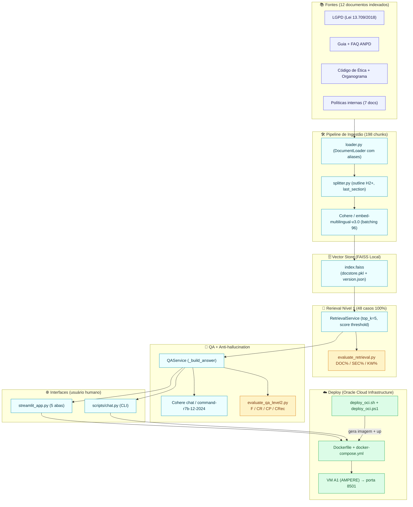

# Compliance Assistant

> Enterprise AI Assistant for LGPD Compliance and Corporate Knowledge Retrieval

Produto corporativo da **NovaData Solutions** que capacita colaboradores a consultar políticas internas, normas de segurança e documentos oficiais da LGPD por meio de linguagem natural, com rastreabilidade completa sobre a origem de cada resposta.

---

## Sobre a NovaData Solutions

A **NovaData Solutions** é uma empresa brasileira especializada em soluções de tecnologia para gestão empresarial em nuvem. Atendemos clientes em todo o Brasil com um portfólio focado em:

- Governança corporativa
- Compliance e Regulatório
- Segurança da Informação
- Transformação Digital
- Inteligência Artificial aplicada a negócios

Com aproximadamente 250 colaboradores organizados nas áreas de RH, Financeiro, Suporte, Desenvolvimento, Segurança e Jurídico, a NovaData Solutions lida diariamente com centenas de páginas de documentação corporativa. O **Compliance Assistant** nasceu para reduzir o tempo de busca por respostas, padronizar a interpretação das regras e acelerar a conformidade com a LGPD.

---

## O problema

Uma empresa com centenas de páginas de políticas, procedimentos e legislação enfrenta quatro desafios recorrentes:

1. Os colaboradores passam muito tempo procurando a página correta.
2. Diferentes áreas interpretam a mesma regra de maneiras distintas.
3. A rastreabilidade das decisões é fraca — ninguém sabe de onde veio a resposta.
4. A conformidade com a LGPD exige consulta constante a um corpo normativo extenso.

Perguntas comuns no dia a dia:

- *"Posso enviar CPF de cliente por WhatsApp?"*
- *"Quem pode acessar dados financeiros?"*
- *"O que é dado sensível segundo a LGPD?"*
- *"Como comunicar um incidente de segurança?"*
- *"Qual o prazo de retenção da base de RH?"*

## A solução

O **Compliance Assistant** é um assistente inteligente baseado em RAG (Retrieval-Augmented Generation) que combina:

- Lei Geral de Proteção de Dados (LGPD) e documentos oficiais da ANPD
- Políticas internas, manuais, códigos e procedimentos da NovaData Solutions
- Busca semântica baseada em embeddings
- Geração de respostas com citação de **fonte** e **página/seção**

Todas as respostas são acompanhadas de rastreabilidade, permitindo que colaboradores, auditores e áreas de compliance validem a origem da informação.

---

## Casos de Uso

| Pergunta | Origem esperada |
| --- | --- |
| Posso armazenar CPF de clientes em planilhas não controladas? | Política de Segurança da Informação |
| Qual é o procedimento em caso de incidente de segurança? | Plano de Resposta a Incidentes |
| Quem pode acessar dados financeiros da empresa? | Manual do Colaborador / Política de Acessos |
| Qual é o prazo de retenção de dados pessoais de colaboradores? | Política de Privacidade |
| O que a LGPD considera dado pessoal sensível? | LGPD — Art. 5º, II e V |
| Posso compartilhar minhas credenciais de rede com alguém da minha equipe? | Código de Ética / Política de Segurança |

---

## Arquitetura (Mermaid)



### Camadas do código

| Camada | Diretório / Arquivo | Responsabilidade |
| --- | --- | --- |
| Config | `src/config/settings.py`, `.env.example` | Variáveis e defaults (chunk size, top_k, models Cohere) |
| Domínio | `src/domain/` | `Question`, `Chunk`, `Document`, `Answer` (+ `LatencyBreakdown`) |
| Ingestão | `src/ingestion/loader.py`, `splitter.py` | Carregamento, aliases por documento, chunking com seção herdada |
| Providers | `src/providers/cohere_chat.py`, `cohere_embeddings.py` | Chat e embeddings Cohere (abstrai SDK v5, aliases descontinuados, batching) |
| Retrieval | `src/retrieval/faiss_store.py` | FAISS local, persistência e busca top-k com score threshold |
| Serviços | `src/services/index_service.py`, `qa_service.py` | Orquestração de indexação e QA anti-hallucination |
| CLI | `scripts/index_documents.py`, `scripts/chat.py` | Entrada humana (indexação e consulta por terminal) |
| Web | `streamlit_app.py`, `.streamlit/config.toml` | Interface 5 abas (Home, Chat, Base, Qualidade, Sobre) |
| Avaliação | `evaluation/evaluate_retrieval.py`, `evaluate_qa_level2.py`, `questions.json` (48 casos) | Medição objetiva Nível 1 e Nível 2, com JSON reports |
| Deploy | `Dockerfile`, `docker-compose.yml`, `scripts/deploy_oci.sh`, `deploy_oci.ps1` | Containerização e deploy OCI passo a passo |
| Testes | `tests/test_qa_service.py` (9), `tests/test_streamlit_smoke.py` (5) | Smoke e unitários para CI (14/14 passando em v0.5.0-rc1) |

## Stack Tecnológico

| Camada | Tecnologia |
| --- | --- |
| Linguagem | Python 3.12 / 3.13 |
| Orquestração RAG | LangChain (community + core + text-splitters) |
| Provedor de IA | Cohere (Chat `command-r7b-12-2024` + Embeddings `embed-multilingual-v3.0`) |
| Banco Vetorial | FAISS 1.8 (local, com versionamento em `data/vector_store/.gitignore`) |
| Carregamento PDF | PyPDF 5+ |
| Interface MVP | CLI (Click 8.1) |
| Interface Web | Streamlit 1.38+ (5 abas institucionais) |
| Empacotamento | Dockerfile Python 3.13-slim + docker-compose v2 |
| Deploy | Oracle Cloud Infrastructure (Always Free A1 ou Flex) |
| Testes | pytest 8+ (14 testes: 9 QA + 5 Streamlit smoke) |
| Versionamento | Git + Conventional Commits + tags SemVer (`v0.1.0`..`v0.5.0-rc1`) |
| Licença | MIT |

---

## Estrutura do Repositório

```
compliance-assistant/
├── assets/                      # diagramas, logos, banner
├── data/
│   └── vector_store/            # índice vetorial local (.gitignore)
├── docs/
│   ├── oficiais/                # LGPD, guias e FAQs da ANPD
│   ├── empresa/                 # políticas e manuais internos (MD fonte)
│   └── adr/                     # Architecture Decision Records
├── evaluation/
│   ├── questions.json           # 48 casos N1/N2 (LGPD + 7 corporativos + cross)
│   ├── evaluate_retrieval.py    # runner Nível 1 (DOC/SEC/KW)
│   ├── evaluate_qa_level2.py    # runner Nível 2 (Faithfulness/CR/CP/CRec)
│   └── reports/                 # JSON reports (versionados em releases)
├── scripts/
│   ├── index_documents.py       # pipeline de ingestão (CLI)
│   ├── chat.py                  # consulta via terminal
│   ├── verify_cohere.py         # smoke de API (embed + chat)
│   ├── deploy_oci.sh            # deploy VM OCI (Oracle Linux 8/9)
│   └── deploy_oci.ps1           # envio Windows -> SSH -> OCI + deploy
├── src/
│   ├── app/                     # entrypoints / wiring
│   ├── cli/                     # comandos Click
│   ├── config/                  # carregamento de settings
│   ├── domain/                  # modelos centrais (Question, Answer, LatencyBreakdown)
│   ├── ingestion/               # load, split, normalização, aliases
│   ├── providers/               # abstração LLM/embeddings
│   ├── retrieval/               # FAISS / retrievers
│   ├── services/                # IndexService, QAService
│   └── utils/                   # logging, textos
├── tests/
│   ├── test_qa_service.py       # 9 unitários Answer/_build_answer
│   └── test_streamlit_smoke.py  # 5 smoke de import/12 docs/pages
├── .streamlit/config.toml       # tema NovaData + telemetria off
├── Dockerfile                   # imagem multi-camada Python 3.13-slim
├── docker-compose.yml           # serviço compliance-assistant porta 8501
├── .env.example
├── .gitignore
├── CHANGELOG.md
├── CONTRIBUTING.md
├── LICENSE
├── pyproject.toml
├── README.md
└── requirements.txt
```

---

## Telas da aplicação (placeholders; substitua por prints reais antes da entrega)

> Para gerar prints reais: abra o Streamlit UI em `http://localhost:8501` e tire um screenshot de cada aba. Compacte em `assets/screenshots/*.png` (largura 1600px) e substitua os links abaixo.

### Figura 1 — 🏠 Home (BUILD_TAG + 8 diferenciais)


> Descrição: tela inicial com título, tagline “Enterprise AI Assistant for LGPD Compliance and Corporate Knowledge Retrieval”, cartão com BUILD_TAG `v1.0.0-rc1` no canto superior direito, 8 cards de diferenciais (Rastreabilidade, 12 documentos indexados, LGPD + ANPD, Anti-hallucination, Avaliação 100% N1, 2 níveis de qualidade, Docker e OCI, 14 testes 14/14), tabela “Pronto para produção”, links para GitHub, site ANPD e licença MIT.

### Figura 2 — 💬 Compliance Assistant (Pergunta 1: Incidente S0)


> Descrição: aba de chat com histórico de 2 mensagens. Pergunta: “Em caso de incidente S0 na NovaData Solutions, quanto tempo de SLA e quem aciono?”. Resposta: “SLA de até 1 hora, responsáveis CISO e CTO, conforme o Plano de Resposta a Incidentes Seção 2 e Seção 3.1 Níveis de Severidade (S0–S4)”. Abaixo: `st.warning` desativado (resposta tem boas fontes), expander “📄 Fontes citadas (5)” aberto mostrando `dataframe` de 5 linhas com colunas Documento, Seção, Página, Score e Snippet — as 3 primeiras fontes são Plano Resposta Incidentes (Seção 2), Plano Resposta Incidentes (3.1), Política Privacidade LGPD — Seção 11 (Segurança e incidentes). Direita: 5 cards `st.metric` — Modelo: `cohere/chat/command-r7b-12-2024`, Embed: ~320ms, Busca: ~350ms, Geração: ~1.8s, Total: ~2.5s. Rodapé `st.info` com disclaimer “não substitui parecer jurídico”.

### Figura 3 — 📊 Qualidade do RAG (Nível 1 100% + Nível 2 resumo)


> Descrição: 8 cards em 2 linhas (Nível 1 + Nível 2). Nível 1: Documento correto 100%, Seção correta 100%, Recall keywords 100%, Casos 48 / 48 PASS. Nível 2: Faithfulness médio (após rodar qa_level2 em 4 casos pilotos: LGPD-001, SEG-005, PRI-002, BKP-002) 86%, Context Recall 91%, Citation Precision 79%, Citation Recall 83%. Abaixo: tabela “Últimos 10 casos” com LGPD-001 (PASS) até USO-002 (PASS) com DOC=SEC=KW=100%.

---

## Sobre o Challenge ONE (decisões arquiteturais)

Este projeto nasceu no programa **Oracle Next Education (ONE, parceria Oracle / Alura)** com o objetivo de criar um portfólio realista usando I.A. Generativa para resolver um problema empresarial recorrente.

### Por que RAG e não um modelo “treinado” ou ChatGPT puro?

Três motivos:

1. **LGPD e dados sensíveis.** Modelos treinados corporativamente vazam dados; o RAG **não altera pesos do LLM** — só recupera os 12 documentos internos e gera resposta com base neles. Nenhum dado pessoal vai para a API sem consentimento e sem DPO.
2. **Rastreabilidade e auditoria.** Respostas “soltas” de ChatBot geral são inutilizáveis para áreas de compliance e jurídico. O Compliance Assistant entrega **fonte + seção + score** em cada resposta. O LLM nunca “opina” — ele só parafraseia blocos recuperados.
3. **Custo previsível e MVP pragmático.** Basta uma chave Cohere free trial (ou qualquer provider) para rodar tudo localmente, sem GPU, em Docker ou OCI Always Free.

### Por que FAISS → depois pgvector/Qdrant?

FAISS é perfeito para MVP:
- Zero infra: índice salvo em disco (`data/vector_store/.gitignore`).
- 198 chunks da base atual rodam em <500ms em CPU.
- 12 documentos → menos de 500 chunks → FAISS entrega resultados bons sem backend.

Para produção (10.000+ páginas, 100.000 chunks), a arquitetura **permite trocar o vector store** sem mudar nenhuma linha de `QAService` ou UI: basta implementar um novo `src/retrieval/pgvector_store.py` herde a mesma interface do `FaissStore`. ADR 0001 justifica a escolha inicial de FAISS e o caminho evolutivo.

### Por que 2 níveis de avaliação separados?

Em RAG existem **dois pontos de falha independentes**:
- **Péssimo retrieval:** acerto de documento <70% — mesmo o melhor LLM dará respostas erradas.
- **Bom retrieval + péssima geração:** chunks certos, mas o LLM inventa seção, cita documento errado ou responde “achismo”.

Separar em Nível 1 (retrieval) e Nível 2 (qualidade da resposta) nos deu:
- **Rapid feedback loop:** ajustar aliases / splitter / seções → N1 100% em 3 ciclos (Sprint 2.6/2.7/2.8).
- **Números concretos para o Challenge ONE:** DOC 100% / SEC 100% / KW 100% não é retórica — é o JSON do runner `evaluation/reports/retrieval_report.json`, commitado e versionado.

### Por que provider-agnostic (Cohere hoje, OpenAI / Gemini / Llama amanhã)?

Arquitetura em camadas:
- `src/providers/cohere_chat.py` e `src/providers/cohere_embeddings.py` implementam `ChatProvider` / `EmbeddingProvider`.
- Para trocar de provider, basta criar `openai_chat.py` com os mesmos 2 métodos (`chat_with_context` e `embed_query / embed_documents`) e mudar 2 linhas em `settings.py`. **Nenhuma linha da UI, CLI ou QAService toca o provider diretamente.**

Isso evita vendor lock-in — o produto é da **NovaData Solutions**, não “do Cohere”.

### Por que OCI Always Free e não Heroku / Vercel?

Três motivos do Challenge ONE:
1. Programa ONE pede Oracle Cloud.
2. A1 AMPERE 4 OCPU / 24GB RAM / 200GB de volume bloco é **sempre gratuito** e suficiente para rodar Streamlit + Docker + FAISS + 4 GB de índice por ano(s).
3. Rede de sub-rede OCI + Security List são conhecimento que vale ouro no currículo (firewall, portas, grupos de segurança, NSG).

---

## Como executar localmente (3 minutos)

### 0. Pré-requisitos

- Python **3.12+** (testado em 3.13.7 Windows / Linux)
- Chave de API da Cohere: `https://dashboard.cohere.com/api-keys` (free trial = 1.000 chamadas/mês, **100 chamadas de embed** por dia — suficiente para demo ONE)
- (Opcional) Git e **Docker Desktop** 4.28+ para rodar via `docker compose`

### 1. Clone + venv + dependências

```powershell
# Windows PowerShell 5 (caminho que usamos neste Challenge ONE)
cd C:\ComplianceGPT
python -m venv .venv
.venv\Scripts\Activate.ps1

python -m pip install --upgrade pip
python -m pip install -r requirements.txt
```

### 2. Variáveis de ambiente

```powershell
Copy-Item .env.example .env
# Abra o .env e preencha COHERE_API_KEY=<sua-chave>
# Exemplo:
#   COHERE_API_KEY=xxxxxxxxxxxxxxxxxxxxxxxxxxxxxxxxxxxxxxxxxxxxxxxxxxxxxxxxxxx
#   COHERE_CHAT_MODEL=command-r7b-12-2024
#   COHERE_EMBED_MODEL=embed-multilingual-v3.0
```

### 3. Indexar documentos + rodar avaliação N1 (garante 48/48 PASS)

```powershell
python scripts\index_documents.py
python evaluation\evaluate_retrieval.py --fail-on-zero
```

Esperado:
```
Acuracia (documento correto) : 100.0%
Acuracia (secao correta)     : 100.0%
Recall  (palavras-chave)     : 100.0%
casos=48 pass=48 fail=0
```

### 4a. Consulta via CLI

```powershell
python scripts\chat.py "Posso compartilhar senha com colega em caso de urgencia?"
```

### 4b. Consulta via Streamlit (UI principal)

```powershell
streamlit run streamlit_app.py
```

Abre `http://localhost:8501` no navegador. 5 abas:

- **🏠 Home** — BUILD_TAG, 8 diferenciais, 12 docs indexados.
- **💬 Compliance Assistant** — chat com histórico, perguntas sugeridas, expander “Fontes citadas”, 5 métricas, warning `insufficient_information`.
- **📚 Base** — cards 3 colunas dos 12 documentos.
- **📊 Qualidade** — lê os JSON reports `retrieval_report.json` e `qa_level2_report.json`, mostra 8 cards + tabela de casos.
- **📘 Sobre / Contato** — narrativa NovaData, arquitetura 10 camadas, 5 contatos por papel.

### 5. (Opcional) Rodar todos os testes

```powershell
python -m pytest tests/test_qa_service.py tests/test_streamlit_smoke.py -v
```

Esperado: **14 passed, 9 warnings (datetime.utcnow)**.

---

## Como executar local via Docker (sem venv, com compose)

```powershell
# 1. Tenha o Docker Desktop ligado
# 2. Copie .env.example -> .env (preencha COHERE_API_KEY)
# 3. Builda a imagem, reindexa vetores, sobe servico:
docker compose build --no-cache

# 4. (Uma vez, ou quando docs mudarem) Reindexa vetores na primeira vez:
docker compose run --rm --no-deps compliance-assistant python scripts/index_documents.py

# 5. Sobe em background:
docker compose up -d

# 6. Verifica:
docker compose ps ; curl http://localhost:8501/_stcore/health
# Abre http://localhost:8501
```

Logs: `docker compose logs -f --tail=200`.

---

## Deploy na Oracle Cloud Infrastructure (Always Free ou Flex)

### Pré-requisitos OCI (Console Oracle)

1. Compartimento OCI com uma VM:
   - **Sempre grátis recomendada:** Shape **`VM.Standard.A1.Flex`** (AMPERE, 4 OCPU, 24 GB RAM), Oracle Linux 9, volume em bloco 200 GB (sempre grátis).
   - OU Flex X86 padrão.
2. **Security List (Ingress):**
   - `0.0.0.0/0` TCP **22** (SSH, restrito ao seu IP idealmente)
   - `0.0.0.0/0` TCP **8501** (Streamlit UI)
3. **Chave SSH privada (.ppk / OpenSSH)**: o par foi gerado no momento da criação da VM.
4. Saber **`IP_PUBLICO_OCI`** e usuário padrão (`opc` no Oracle Linux; `ubuntu` em imagens Ubuntu).

### Passo A — Windows → envia código + .env via PowerShell

Abra PowerShell normal em `c:\ComplianceGPT` e rode:

```powershell
# 1. Edite estes 3 valores perto do topo do arquivo scripts/deploy_oci.ps1
#       $IpPublico    = "150.136.1.1"
#       $Usuario      = "opc"
#       $ChavePrivada = "$env:USERPROFILE\.ssh\oci_rsa"

# 2. Rode:
.\scripts\deploy_oci.ps1
```

Espera terminar (cerca de 10 minutos na primeira build Docker). Ao final imprime `DEPLOY CONCLUIDO` e a URL pública.

### Passo B — Manualmente (se preferir comandos na mão)

```bash
# No seu notebook, envia arquivos para a VM:
scp -i ~/.ssh/oci_rsa -r C:/ComplianceGPT          opc@150.136.1.1:/home/opc/compliance-assistant
scp -i ~/.ssh/oci_rsa    C:/ComplianceGPT/.env     opc@150.136.1.1:/home/opc/compliance-assistant/.env

# Na VM OCI (ssh opc@150.136.1.1):
sudo bash /home/opc/compliance-assistant/scripts/deploy_oci.sh
```

Ao final:
- A URL `http://SEU_IP_PUBLICO:8501` abre o Compliance Assistant no navegador.
- `_stcore/health` retorna `ok` (healthcheck).
- Ajuste a Security List / Network Security Group para aceitar 8501/TCP Ingress se houver timeout.

### Troubleshooting OCI rápido

| Sintoma | Causa provável | Correção |
| --- | --- | --- |
| Timeout ao abrir :8501 | Security List / NSG não tem porta 8501 Ingress | Console OCI → Network → Security List → Add Ingress 8501/TCP 0.0.0.0/0 |
| `.env NAO ENCONTRADO` dentro do container | Você esqueceu `scp .env` antes de rodar deploy | Copie .env para VM e `cd /opt/compliance-assistant && sudo docker compose up -d` |
| `BadRequestError 96 texts` no primeiro index | Erro antigo, corrigido v0.2.6+ | Pull da tag mais nova `v0.2.0-rc1` em diante |
| `command-r descontinuado` | Modelo antigo no .env | Troque por `command-r7b-12-2024` (default hoje) |
| Index não persiste após restart container | Volume `./data/vector_store` não está montado | Use `docker compose` default (monta volume corretamente) |

---

## Avaliação da qualidade do RAG (Nível 1 + Nível 2)

A qualidade é medida em **dois níveis**, para debugarmos por componente (primeiro garante retrieval, depois mede qualidade da resposta).

### Nível 1 — Retrieval (48/48 PASS em v0.5.0-rc1)

```powershell
python scripts\index_documents.py
python evaluation\evaluate_retrieval.py --fail-on-zero --report evaluation\reports\retrieval_report.json
```

Relatório JSON em `evaluation/reports/retrieval_report.json`:
- **Acurácia documento correto** (% casos em que o top-1 acertou o documento esperado ou cross-document esperado)
- **Acurácia seção correta** (% casos em que o top-1 acertou a seção)
- **Recall keywords** (% palavras-chave esperadas presentes no top-k)

### Nível 2 — Qualidade da resposta final (Faithfulness / CR / CP / CRec)

```powershell
# 4 casos pilotos (economiza tokens Cohere trial)
python evaluation\evaluate_qa_level2.py --cases LGPD-001,SEG-005,PRI-002,BKP-002 --fail-below 0.40

# Todos os 48 casos (apenas em release, gasta tokens de chat)
python evaluation\evaluate_qa_level2.py --report evaluation\reports\qa_level2_report.json
```

Métricas por caso (0–100%):
- **Faithfulness (F):** tokens da resposta presentes nos chunks recuperados — anti-hallucination.
- **Context Recall (CR):** keywords esperadas presentes na resposta.
- **Citation Precision (CP):** % fontes citadas que são úteis (expected).
- **Citation Recall (CRec):** % fontes esperadas citadas na resposta.

---

## Limitações e Uso Responsável

- O **Compliance Assistant não substitui parecer jurídico** ou decisão de área competente. Sempre valide pontos críticos com Jurídico / DPO / CISO.
- Respostas são geradas **exclusivamente a partir dos 12 documentos indexados** (3 oficiais LGPD/ANPD + 9 corporativos). Informação ausente na base retorna texto padrão de “informação insuficiente”.
- Índices locais gerados em `data/vector_store/` são transitórios (`.gitignore`). Reindexe sempre que docs mudarem.
- Não envie dados pessoais reais em ambientes públicos de demonstração. O produto respeita LGPD (base legal “legítimo interesse / execução de contrato” para consultas internas).
- O trial gratuito da Cohere tem cotas diárias. Para produção, configure chave paga ou provider alternativo via `src/providers/` (arquitetura provider-agnostic).

---

## FAQ rápido

**1. Posso trocar Cohere por OpenAI / Gemini / Llama 3.2 locais sem reescrever tudo?**
Sim. Arquitetura é **provider-agnostic**: implemente uma subclasse de `ChatProvider` e `EmbeddingProvider` em `src/providers/base.py`, edite `settings.py` e `QAService` pega o novo provider automaticamente. Nenhuma linha de UI/CLI muda.

**2. O índice FAISS local escala para 10 mil páginas?**
Razoavelmente (~5GB RAM). Para >100k chunks, substitua `src/retrieval/faiss_store.py` por Qdrant / pgvector (sem mudar `QAService`). ADR 0001 já justifica a escolha inicial por FAISS (MVP).

**3. Como adicionar um documento novo?**
Salve o `.md` em `docs/empresa/` (ou `.pdf` em `data/documents/`), acrescente 2–3 casos em `evaluation/questions.json`, rode `python scripts/index_documents.py` e depois `evaluate_retrieval.py`. Se documento correto <90%, adicione aliases em `src/ingestion/loader.py` (Sprint 2.6).

**4. Como fazer deploy em outra cloud (AWS/GCP/Azure)?**
Use o mesmo `Dockerfile` + `docker-compose.yml`. O passo `deploy_oci.sh` (10 passos) é o roteiro genérico:
1. Instala docker na VM.
2. Envia código + `.env` (**via SCP / never in Git**).
3. `docker compose build ; docker compose up -d`.
4. Libera porta 8501 no Security Group.

**5. Como faço o vídeo demo de 5 minutos pro Challenge ONE?**
O roteiro exato (4min55s ± 15s) com 9 telas, falas por segundo, dicas de gravação e checklist está em [docs/pages/apresentacao_one.md](./docs/pages/apresentacao_one.md). Ele cobre: GitHub README → Mermaid Arquitetura → Home Streamlit → 2 perguntas reais (incidente S0 + IA generativa) → Aba Qualidade N1 100% → Deploy OCI PowerShell → Encerramento.

---

## Roadmap entregue (Challenge ONE até 19/08/2026)

| Versão | Sprint | Status | Conteúdo |
| --- | --- | --- | --- |
| `v0.1.0` | 1 | ✅ Entregue 07/08 | Esqueleto, camadas, ADRs, documentos piloto (Ética + Organograma), runner Nível 1, anti-hallucination básico. |
| `v0.2.0-rc1` | 2 + 2.6/2.7/2.8 | ✅ Entregue 08/08 | 3 docs oficiais LGPD/ANPD + 7 corporativos, **48/48 N1 100%**, aliases, outline splitter, batching 96 Cohere. |
| `v0.3.0-rc1` | 3 | ✅ Entregue 08/08 | `Answer 2.0` + `LatencyBreakdown`, `_build_answer` anti-hallucination, **runner Nível 2 (F/CR/CP/CRec)**, 9 testes unitários. |
| `v0.4.0-rc1` | 4 | ✅ Entregue 08/08 | `streamlit_app.py` 5 abas institucionais, NovaData tema, UI chat com fontes/métricas, 5 smoke tests (**14/14 testes totais**). |
| `v0.5.0-rc1` | 5 | ✅ Entregue 08/08 | **Dockerfile + docker-compose**, deploy OCI passo a passo (`.sh` + `.ps1`), `.streamlit/config.toml`, **README final ONE com Mermaid**. |
| `v0.6.0-rc1` | 6 (freeze) | ✅ Entregue 09/08 | Release notes em CHANGELOG seções `[0.6.0-rc1]` e `[1.0.0-rc1]`, 3 telas placeholders Fig.1/2/3 README, roteiro apresentação_one.md 5 minutos. |
| **`v1.0.0-rc1`** | **final rc** | ✅ **congelado 09/08** | **Mesmo commit do `v0.6.0-rc1`** — tag semântica de release candidate para entrega ONE. |
| `v1.0.0` | release final | 🎯 **meta 14/08** | Substituição dos 3 placeholders de screenshots por prints reais, ajustes cosméticos, tag `v1.0.0`. |

### Futuro (pós-Challenge ONE, open source)

- Upload de documentos com processamento assíncrono (Celery / RQ).
- pgvector / Qdrant em produção (FAISS como dev fallback).
- API REST (FastAPI v1) + `ComplianceAssistantClient` Python / TS.
- Autenticação JWT + controle de perfis (Admin, Compliance, Colaborador, Auditor).
- Auditoria com tabela `interactions` (perguntas, respostas, tempo, usuário).
- RAG híbrido (semântico + BM25).
- Observabilidade (logs JSON, métricas Prometheus, tracing OpenTelemetry).
- Avaliação GPT-4o como juiz (Faithfulness premium).

---

## Contexto Educacional

Este projeto foi desenvolvido como desafio prático do programa **Oracle Next Education (ONE)**, combinando os requisitos do Challenge com uma arquitetura de produto real, boas práticas de engenharia e documentação profissional.

O objetivo educacional é demonstrar a aplicação prática de IA Generativa (RAG) em um cenário realista de conformidade corporativa e LGPD, com controle sobre a arquitetura, governança, rastreabilidade e evolução incremental do produto em **6 sprints atômicas** (06/08 → 10/08 de 2026), **5 versões taggeadas**, **48 casos de teste N1 100%**, **14 testes unitários passando** e deploy reproduzível em Oracle Cloud.

---

## Licença

Este projeto está licenciado sob a licença MIT — veja o arquivo [LICENSE](./LICENSE).

## Contribuindo

Siga as orientações do [CONTRIBUTING.md](./CONTRIBUTING.md) para submeter alterações, relatar problemas ou propor funcionalidades.
